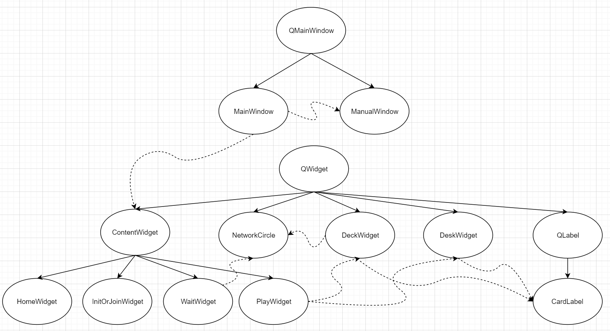

# 扑克牌游戏项目设计说明

课程：面向对象程序设计

指导老师：陈奇

小组成员：黄彦玮（组长）、陈易、王英豪、于倚岑

完成时间：2020年7月 

## 一、需求分析

我们希望实现一个直观的，易上手的扑克游戏，将 windows 上的游戏“争上游”和“红心大战”作为参考对象，具体需求大致如下：

- 直观的 GUI 界面，用于与用户的交互，能显示4人的手牌与出牌情况，各玩家的状态（是否托管）
- 两种纸牌游戏的规则实现，能检查出牌是否合法、判断游戏胜利等，对于红心大战，在出牌的基础上还需要实现换牌、计分等功能
- 纸牌游戏的 AI 实现，用于托管或直接作为填充人数的方式
- 网络模块，用于局域网联机，应当保证传输质量，支持错误检测
- 统筹各模块的核心 API

## 二、总体设计

程序总体上分为4个模块：逻辑模块、网络模块、AI 模块、界面模块。逻辑模块负责游戏主逻辑实现，网络模块负责网络层搭建，AI 模块负责AI 策略设计及实现，界面模块负责前端界面设计及实现。

具体任务为：

- 逻辑：实现一系列回调函数，完成游戏功能，设计合适的数据结构和类，并对代码进行合理的封装。
- 网络：提供一套网络通信 API，实现局域网联机功能。
- AI：实现两个游戏的 AI,使其满足一定的智能性，将游戏的难度控制在合理的程度。
- 界面：通过 Qt 开发出一个友好的用户图形界面，最终结果应类似于 Win7 内置纸牌游戏的游戏界面。

为实现联机游戏，我们的程序集合了服务端与客户端的功能。若用户选择“新建游戏”，则当前用户所使用的程序即成为服务端，并且会在局域网内发送广播。若用户选择“加入游戏”，则当前用户所使用的程序即成为客户端，在接收到服务端发出的广播后可以建立连接。

## 三、系统模块说明

### 网络模块

#### 基本介绍

- 网络模块使用 winsock2 作为底层实现，对其进行进一步封装和抽象，最终实现了一个具有一定错误处理，功能定制能力的网络库。

#### 继承关系

- 网络模块继承关系如下


#### 核心类说明：

- 各 Socket 类：对 winsock 的封装，包含建立连接，收发消息，设置socket状态（阻塞、非阻塞）等功能。
- Broadcaster：UDP 广播的收发，负责发现服务器。
- DataStream：对 DataSocket 的进一步封装，用于收发带分隔消息与处理MTU限制带来的包分割，`sendLine(W)` 与 `getLine(W)` 是两个版本，分别接受 ascii 字符和 UTF16 字符。
- Client：对客户端处理服务端连接功能的封装，包括心跳，关闭连接等指令的处理，使用 `handleMessage`处理服务端信息。
- Server：对建立服务端功能的封装，包括广播与接收连接。
- Worker：对服务端处理客户端连接功能的封装，包括心跳，关闭连接等。

### AI 模块

#### 基本介绍

- AI模块实现了3人争上游和4人红心大战的AI。

#### 继承关系

- AI模块设计了Type类表示争上游游戏中可能出现的各种牌型，下有One, Two, Three, Four, Four_Two, Three_Two, Dragon, Rocket, Plane派生类。

#### 核心类说明

Type类的主要成员函数如下：

- rank: 一次出牌的相对大小，以这些牌中最小的牌为基准。
- type: 表示该次出牌的类型。
- play_card: 得到这些牌在手牌中的ID。
- impossible_better: 剩余的牌是否能管上，1表示不能管上，0表示有炸弹能管上，-1表示没有炸弹也能管上。
- check_type: 检查两个顺子的宽度是否相同（如单顺宽度是1，双顺宽度是2，它们之间不能互相压制）
- getlast: 检查这些牌中最大的牌。
- getother: 得到这些牌中无实际意义的牌的大小（如三带二的对子）
- getlength: 得到顺子的长度。

### 界面模块

#### 基本介绍

- 界面模块基于 Qt 进行各个游戏界面的封装，最终形成一个 MainWindow 窗口类供逻辑模块进行调用，实现与用户的交互

#### 继承关系

- 界面模块继承（实线）和调用（虚线）关系如下



#### 核心类说明：

- MainWindow: 程序窗口类，提供相关方法供逻辑模块进行调用，管理用户与程序之间的交互
  - API 列表
    - `StartNetworkEventLoop`/`EndNetworkEventLoop`: 启动/停止网络事件循环，实际上是启动/停止一个定时调用网络事件处理接口的函数
    - `SetInfo`: 设置界面提示信息（不同界面都有显示提示信息的文字框）
    - `DrawHomePage`: 绘制并切换到主页
    - `DrawInitPage`: 绘制并切换到新建游戏界面
    - `DrawJoinPage`: 绘制并切换到加入游戏界面
    - `DrawWaitingPage`: 绘制并切换到等待界面
    - `AddPlayer`: 在等待界面添加玩家
    - `RemovePlayer`: 在等待界面移除指定玩家
    - `SetNetworkStatus`: 在等待界面更新指定玩家的网络信息
    - `DrawPlayingPage`: 绘制并切换到游戏界面
    - `UpdatePlayer`: 在游戏界面更新指定玩家的信息（如网络信息、是否被机器人托管等）
    - `UpdateCards`: 在游戏界面更新指定玩家的手牌状况
    - `ClearDesk`: 在游戏界面情况指定玩家的出牌区
    - `UpdateStatistics`: 在游戏界面（红心大战模式下）更新玩家积分
    - `EndGame`: 弹出游戏结束提醒对话框
- ContentWidget: 程序显示内容类，纯虚类，即窗口中除工具栏的部分
  - HomeWidget: 主页
  - InitOrJoinWidget: 新建/加入游戏页
  - WaitWidget: 等待页
  - PlayWidget: 游戏页
- ManualWindow: 帮助窗口类，显示程序使用说明
- DeckWidget: 手牌显示
- DeskWidget: 出牌区

### 逻辑模块

#### 基本介绍

- 逻辑模块负责统筹上述各个模块，进而实现游戏各个功能，包括开始游戏、新建游戏、加入游戏、出牌（含换牌和AI）、重玩、计算游戏结果等等。同时，我们将事件处理（如服务端和客户端的交互）加入了系统的消息循环中，因此逻辑模块还重点实现了服务端和客户端的事件处理部分。

#### 核心类说明

为实现两种游戏的功能，我们需要设计类来分别表示牌和牌组，具体如下：

```C++
enum GameType {
  Winner,  // 争上游
  Hearts   // 红心大战
};
enum Suit {
  Club,     // 梅花
  Diamond,  // 方块
  Spade,    // 黑桃
  Heart     // 红桃
};
//单张牌
class Card { 
public:
  Suit suit;
  unsigned short rank;   // 1~13分别对应点数A~K，14表示小王，15表示大王，16表示未知（即隐藏状态）
  bool operator == (const Card &u);
  Card(Suit suit, unsigned short rank);
  Card(const Card& u);
  Card & operator = (const Card & u);
  wstring towstring() const;           //将牌翻译成wstring字符串，用于服务端和客户端的交互
};
//牌组
class card_list{
public:
    unsigned short size;                 //牌的张数
    Card* cards;                         //牌数组
    card_list();
    card_list(const card_list &u);
    ~card_list();
    card_list & operator = (card_list& u);
    void ins(Card u);                    //向牌组中插入牌
    void DeleteCard(unsigned short pos); //删除牌组中下标为pos的牌
    wstring towstring() const;           //将牌翻译成wstring字符串，用于服务端和客户端的交互
}
```

####API说明

逻辑模块实现了下列API：

```C++
void NetworkEventProcess();
void ServerEventProcess();
void ClientEventProcess();
void NewGame(const wstring &password, const wstring &player_name,
             const GameType type);
void JoinGame(const wstring &password, const wstring &player_name);
void AddBot();
void StartGame();
void deal_cards();
void AIChange(unsigned short id);
void AIPlay(unsigned short id);
void letplay(const unsigned short id);
void Play(const Card cards[], const unsigned short size);
bool CheckRules(const Card cards[], const unsigned short size, const GameType type, card_list &cur);
void calc_statistics();
void PlayAgain();
void Home();
void Exit();
```

说明：

- `NetworkEventProcess`/`ServerEventProcess`/`ClientEventProcess`:  `NetworkEventProcess`即界面模块中调用的一个定时调用网络事件处理接口的函数，主要用于处理用户端和服务端的交互。如果当前端为服务端，调用`ServerEventProcess`函数，否则调用`ClientEventProcess`函数
- `NewGame`: 用于用户“新建游戏”行为的处理，将当前端设为服务端，并发送广播
- `JoinGame`: 用于用户“加入游戏”行为的处理，将当前端设为客户端，并接收广播
- `AddBot`: 用于用户“添加Bot”行为的处理，加入一个AI玩家
- `StartGame`: 用于处理服务端“开始用户”行为，启动游戏并向客户端发出开始游戏的指令
- `deal_cards`: 用于新牌局前发牌
- `AIChange`: 红心大战中AI玩家换牌
- `AIPlay`：红心大战中AI玩家出牌
- `letplay`: 将出牌权交给某个指定玩家
- `CheckRules`: 检查用户所出的牌是否符合游戏规则
- `SetNetworkStatus`: 在等待界面更新指定玩家的网络信息
- `DrawPlayingPage`: 绘制并切换到游戏界面
- `calc_statistics`: 统计游戏结果
- `UpdateCards`: 在游戏界面更新指定玩家的手牌状况
- `PlayAgain`: 用于用户“再来一局”行为的处理
- `Home`: 用于用户“回到主页”行为的处理
- `Exit`: 游戏退出时的一些必要处理

####交互说明

在服务端和客户端的交互中，我们使用收发字符串的形式进行信号的发送和处理。在发送时，首先通过card_list类和Card类的towstring()方法将牌组转化成字符串，再进行发送。在处理时，利用Parse.h和Parse.cpp提供的解析函数，将字符串翻译为游戏需要的信息。

各类交互的格式如下：

1、广播，用于客户端连接服务端（同时公布游戏类型）

```C++
//Server
-connect gametype  //gametype：游戏类型

//Client
-connect_join player_name password   //player_name：玩家名称 password：房间密码
```


2、服务端告知客户端密码错误

```C++
//Server
-wrong_password
```


3、服务端告知客户端玩家人数超过上限

```C++
//Server
-player_exceeded
```


4、公布玩家在游戏中的顺序（按出牌顺序即逆时针顺序）

```C++
//Server
-player_rank num_of_player  //num_of_player：玩家人数
             player0_name player0_status player0_controled_by_robot 
             player1_name played1_status player1_controled_by_robot
             ...            //每行3个参数分别为玩家的名称、网络状态、是否托管
```


5、更新所有玩家网络状态

```C++
//Server
-upd_status player0_name player0_network_status player0_controlled_by_bot
            player1_name player1_network_status player1_controlled_by_bot
            ...             //每行3个参数分别为玩家的名称、网络状态、是否托管
```

 

6、发牌

```c++
//Server
-deal_cards [[Suit_0, Rank_0], [Suit_1, Rank_1],...] 
```


7、出牌：

```C++
//Server
-play
//Client
-play [[Suit_0, Rank_0],[Suit_1, Rank_1],...] 
```


8、获取玩家网络状态

```C++
//Server
-check_network
//Client
-check_network 1(or 0)//status
```


9、出牌公示

```C++
//Server
-info player_name [[Suit_0, Rank_0], [Suit_1, Rank_1],...] 
```


10、公布玩家得分

```C++
//Server
-score player0_name player0_score
```


11、发布游戏结束指令（同时进入下一局）

```C++
//Server
-over 0/1
```


12、红心大战换牌部分

```c++
//Client
-change_out [[Suit_0, Rank_0], [Suit_1, Rank_1],...]      //换出的牌
    
//Server
-change_in [[Suit_0, Rank_0], [Suit_1, Rank_1],...]       //换入的牌
```


13、客户端逃跑，向服务端发送信息

```C++
//Server
-escape
```

 

14、服务端玩家选择重玩

```C++
//Server
-replay
```

 

15、红心大战每一轮结束，令客户端清空所有玩家出牌区

```C++
//Server
-clear
```

 

字符串解析部分的API如下：

```C++
void ssplit(wstring& s, vector<wstring>& sv);
void card_list_parse(const vector<wstring>* const sv, unsigned short pos, card_list &cur);
void connect_join_parse(wstring &raw, wstring &player_name, wstring &password);
void player_rank_parse(wstring &raw, unsigned short& num_of_player, wstring* player_names,  double* network_status, bool* controlled_by_bot, wstring current_name);、
void upd_status_parse(wstring &raw, const wstring* const player_names, double* network_status, bool* controlled_by_bot);
void deal_cards_parse(wstring &raw, card_list &cur);
void play_parse(wstring &raw, card_list &cur);
void info_parse(wstring &raw, wstring &name, card_list &cur);
void score_parse(wstring &raw, const unsigned short num_of_player, const wstring* const player_names, unsigned short* points);
void change_in_parse(wstring &raw, card_list &cur);
void change_out_parse(wstring &raw, card_list &cur);

```

说明：

- `ssplit`: 根据关键字将源字符串切割成若干部分，便于后续分析（类似Python中的split函数）
- `card_list_parse`: 和card_list类的towstring()方法相反，将字符串翻译成card_list类对象
- `NewGame`: 用于用户“新建游戏”行为的处理，将当前端设为服务端，并发送广播
- `JoinGame`: 用于用户“加入游戏”行为的处理，将当前端设为客户端，并接收广播
- `connect_join_parse`: 对应上述交互类型1中的字符串解析
- `player_rank_parse`: 对应上述交互类型4中的字符串解析
- `upd_status_parse`: 对应上述交互类型5中的字符串解析
- `deal_cards_parse`: 对应上述交互类型6中的字符串解析
- `play_parse`：对应上述交互类型7中的字符串解析
- `info_parse`: 对应上述交互类型9中的字符串解析
- `score_parse`: 对应上述交互类型10中的字符串解析
- `change_in_parse`: 对应上述交互类型12中的字符串解析，用于客户端解析服务端换入的牌
- `change_out_parse`: 对应上述交互类型12中的字符串解析，用于服务端解析客户端换出的牌

## 四、系统设计难点与解决

### 逻辑模块

##### 1、代码复用

增加代码复用率是逻辑模块的一个重点，这不仅是提高编程效率的要求，也是让代码变得更简洁的必然要求。在这一问题上我思考了很长时间，最终得到了如下解决思路：

（1）普通玩家和电脑玩家本身都是玩家，因此拥有共同的换牌、出牌等操作，这些操作在处理的时候代码可以共用。但是，前者的出牌是由玩家出牌的信号触发的，后者则是由服务端检测到当前轮到AI出牌时触发。

**解决方案：**我设计了一个当前玩家出牌使能`canplay`（服务端和客户端均使用）和一个用于服务端的函数`void letplay(unsigned short id)`，前者表示当前玩家此时是否具有出牌权，后者表示指示id这个玩家出牌，分为3种情况：

a)如果该玩家是当前玩家，则将`canplay`使能置为`true`

b)如果该玩家不是当前玩家，且是人工玩家，但没有被托管，则向客户端发出指令，将对应客户端的`canplay`使能置为`true`

c)如果该玩家被托管或者是AI玩家，则调用AI模块的API出牌

出牌之后的记录和结果统计是共用的，具体体现在`CheckRules`和`calc_statistics`两个函数中，分别用于检查出牌是否合法和计算出牌结果，这就大大提高了代码复用率。

（2）在客户端与服务端的交互过程中，需要大量用到字符串的编码和译码，为提高代码复用率，就需要设计函数专门负责编码和译码。

**解决方案：**这里最主要实现的一个功能就是将`card_list`类（即一组牌）翻译成对应的字符串，而card_list类又是通过许多`Card类`（单张牌）的成员组成的，因此我对`card_list`类和`Card`类分别写了一个成员函数`towstring()`用于翻译成字符串，前者的成员函数需要调用后者的成员函数。在解码时，也同样写了一个`card_list_parse()`函数用于翻译回`card_list`对象，这就提高了代码复用率。

#####2、网络通信带来的同步、异步等问题

这一问题是整个逻辑模块遇到的最难的问题，期间也经历了多次调整。这一问题实际上可分为三个子问题——“网络模块本身是否阻塞”、‘窗口显示是否阻塞“和“顶层模块在处理各类信号时的同步异步关系”。

对于“网络模块本身是否阻塞”这个问题，最初的设计中是阻塞的，即服务端建立连接时不能同时进行其他操作，直到客户端全部连接，而且必须限定连接人数，只有当连接人数满才能继续做后面的工作，这对用户体验会产生很大的影响。因此，经过一系列的沟通，我们将网络模块换成了非阻塞的版本，也正因此实现了游戏人数的动态调整，服务端可以根据当前连接的人数实时选择是否开始游戏。

对于”窗口模块是否阻塞“这个问题，最初的设计中同样是阻塞的，即不支持顶层模块处理和窗口显示的同步运行，必须等待Qt的`exec()`函数返回后才可以显示窗口，这就带来一个问题：当AI在运行时，玩家所出的牌不会及时显示在用户界面上，特别是单机版红心大战中，玩家可能根本看不见自己出的牌就进入下一轮了，这同样对用户体验会产生很大的影响。因此我们后来也将窗口模块改成了非阻塞版本。

对于“顶层模块在处理各类信号时的同步异步关系”这一问题，**答案其实是唯一的——必须同步处理服务端和客户端交互的信号**。顶层模块需要处理的信号可以分为两类：一类是用户操作触发的信号，比如用户出牌后的处理，这些信号是通过窗口模块调用顶层模块提供的回调函数实现的；另一类是客户端（或服务端）发来的信号，而客户端和服务端交互的内容往往都需要非常及时的处理。如果将后者放在和处理前者所用的函数中，那么如果某一用户不进行操作，服务端和客户端的交互就可能陷入停滞，从而导致信息不同步等严重的后果。这就决定了必须同步处理两类信号。

**解决方案：**我们将服务端和客户端交互的部分集合为一个函数`NetworkEventProcess()`，加入系统的消息循环中，由窗口模块提供的接口`StartNetworkEventProcess()`和`EndNetworkEventProcess()`启动或关闭消息循环。因此，服务端和客户端每隔固定的一段时间就会检查一下彼此发送的信号，从而实现信息的及时交互。

### 网络模块

- winsock2 的文档不是很完善，而且缺少例子，需要在 stack overflow 上慢慢摸索。
- 网络程序难以调试，在本机测试正常的功能在生产环境中仍然出现问题。经过与 API 负责人的漫长联合调试解决问题。
- 为了保证间接性与安全性，整个网络模块没有使用多线程。但是 c++ 缺少对单线程异步的语法工具，只能自己用一个计时器模拟，在具体使用中用轮询处理。

### AI 模块

- 争上游游戏中，对手牌的分析对AI强度有重要的影响，我先把所有可能的顺子组合通过搜索的方式列出，逐个比较得到较优的分解方法，然后判断当前回合最优的行动。
- 红心大战比较重要的一个环节是判断这一回合是否要故意收牌，我运用动态规划求解出出一张牌的收牌概率以及得分概率，根据这些信息判断出小还是出大。
- 由于初期沟通的问题，我对争上游有一些误解，认为该游戏只支持3人游戏，于是默认了人数为3，等到发现时已经较难处理手牌数和人数的区别，所以 AI 模块现在暂时**只支持3人游戏**。

### 界面模块

- 本来是打算一个界面一个窗口类，然后全部继承于一个抽象基类的，但后来发现 Qt 的转换界面的时候无法屏蔽系统的动画，导致从一个界面变换到另一个界面的时候会出现闪烁。于是改成了所有界面共用一个 MainWindow 类，但类里面有个 Widget 成员，不同界面的 Widget 成员类型不同但基于同一个抽象基类，每次切换界面时只切换 Widget，解决了界面闪烁的问题
- 四个人的手牌和出牌区显示基本相同但略有区别，为了提高代码的重用性，决定传入几个 bool（作用与 Flags 相同），在有区别的地方进行分别处理
- Qt 的文档有些函数的行为描述不太清楚，而且访问挺慢的，得自己不断摸索
  - 比如为了让玩家看清楚 AI 出的牌，逻辑模块会使用 Sleep 函数，但是 Qt 的绘制不是立即绘制的而是放进事件循环过一段时间之后才绘制的，寻找立即处理完事件循环里面所有事件的函数就花了很长时间

## 五、总结

### 逻辑模块

- 编写逻辑模块代码的过程不仅是对编程能力的考验，更是对沟通能力的锻炼。由于这一模块的特殊地位，我在编写时需要和团队的所有成员进行沟通API，并且建立在对这些功能的充分理解之上才能写出正确的代码。在调试过程中，我同样需要判断问题究竟是出在顶层模块自身还是下层的其他模块中，很多bug由于复现困难的问题需要我和负责具体模块的同学联合调试才能调试成功，这也非常锻炼团队协作能力。虽然在沟通中还是不可避免地出现了一些小问题，但主要功能仍然实现地非常顺利，还是非常欣慰的。
- 注重代码维护。本次实验全程采用github进行团队合作开发，提高了团队合作的效率，但仍有可以改进之处：由于我们四个人将四个模块在不同的分支上进行开发，我在调试时需要首先爬取所有人的更新，而这一部分可以很简单地利用github的submodule功能实现，在今后的实验中吸取经验，加以使用。
- **程序的不足**：在实现的过程中还有一些细节的功能未能实现，例如换牌阶段玩家断线时系统进行托管、断线后重连等问题，这些问题可以在后续进一步完善。同时，AI暂时只能适用于标准版的两个游戏，即对玩家数作出了一定的限制，但我们做的很好的一点是除了AI模块都做好了游戏人数的兼容，后续可以通过直接修改AI模块很方便地进行扩展。

### 网络模块

- 对于一个模块而言，一开始明确具体的调用结构非常重要。实际实现中我选择了先给发出所有函数声明与引用关系，最后给出实现，大大减少了重构的次数。
- 善用命名空间和宏可以很好地整理代码。

### AI 模块

- 代码实现时一定要注意代码的复用性。
- 多与其他成员沟通需求，防止因理解错误导致将工作复杂化。


### 界面模块

- 合作前的沟通十分的重要，除了沟通 API 之外，每个 API 的大概实现和调用场景最好也要有个沟通，因为如动态内存管理之类的东西只通过函数原型是体现不出来的
- 这次代码有个问题，就是没有利用命名空间之类的特性，导致有些类明明是不希望在这份源文件之外的代码中使用的，却可以在包含头文件之后轻易的调用

## 附录一、程序使用说明

####注：此份说明在 游戏-help-Manual 中也可找到

使用方法：将压缩包整个解压到一文件夹下后，运行oop2020.exe即可启动游戏。

### 游戏操作

* 在同一局域网中，一人新建游戏后其他人加入即可
* 同一局域网不要在同一时间进行多个游戏的组局操作
* 若有人掉线，则 AI 模块会自动接管
* **本程序支持的游戏人数为**（注：AI模块限定人数是由于标准的争上游游戏和红心大战游戏的人数分别为3和4。除AI模块外，其他所有模块均对不同人数实现了兼容，故此处非常易于扩展，如需扩展只需要修改AI即可）
  * 争上游：全部为玩家联机时2~4人，有AI参与时限定为3人（可同时带AI和玩家，但人数必须为3人）
  * 红心大战：限定为4人（可同时带AI和玩家，但人数必须为4人）

### 游戏规则

#### 争上游

* 2/3/4个人 每人22/18/13张（2个人的时候，留10张作为底牌，故每人22张；4个人的时候，留2张作为底牌，故每人13张）

* 牌型

  * 单张、对子、三张、炸弹（4张相同的）、王炸、三带二、顺子（>=5张）、连对（>=3个）、三顺（>=2个）、四带二（四个一样的带两张任意的牌）、飞机（三顺+相同个数的对子，对子不要求一定相邻但不能重复，如3334445566, 3334445556699KK），**三带一不支持**

  * 单张牌点数比较为大王>小王>2>A>K>Q>J>10>...>3

  * 所有的顺子、双顺、三顺、连对等牌型都必须按照上述规则，如334455, 34567, QQQKKKAAA等，必须从>=3的数开始，到<=A的数结束，2不可以参与所有的这类牌型，如以下牌型是不合法的：23456, AA2233

* 大小比较：10,J,Q,K,A > 9,10,J,Q,K > 8,9,10,J,Q > ... > 3,4,5,6,7 其他类推

  * 三带二、四带二、飞机这种“大带小”的牌型，按“大”的点数大小比，如99944>88855，如果一样则后者不能大过前者，如99944（先出）不可被99955（后出）压过

  * 王炸>四张炸>普通牌           四带二不算炸弹，算普通牌型

  * 当前玩家是本轮第一个出牌的玩家，可以任意出，否则，所出的牌必须大过上一个出牌的人才可以出牌

#### 红心大战

* 4个人 每人13张 去掉大小王
* 逆时针出牌
* 第一次向下家传，第二次向上家传，第三次向对家传，最后一次不传
* 传完之后，持有草花2的人先出牌，且必须出草花2
* 黑桃Q是13分，所有红桃牌都是1分，别的牌都是0分
* 点数排名A>K>Q>...>3>2
* 每轮与第一个出的牌的花色相同的牌中点数最大的人获得这轮牌的分数之和，最后总分最小的胜
* 当前玩家是本轮第一个出牌的玩家，可以任意出（除了第一轮必须出草花2），否则，若手中有和第一个出牌的人所出的牌同样的花色的牌，则必须出一张同花色的牌，否则可以任意出

### 操作截图

* 主页
  
* 新建游戏界面
  
* 加入游戏界面（注：测试时可先打开服务端选择“新建游戏”后，再打开客户端选择“加入游戏”，便可建立连接）
  
* 等待界面（房主端）（注：此时房主可以通过”加入Bot“添加AI玩家，也可以点击”开始游戏“启动游戏，并向客户端发送开始游戏的指令）
  
* 争上游
  
* 红心大战
  

## 附录二、系统开发日志

本次实验自5月11日启动，7月4日完成，截至撰写本实验报告时，我们的github工程的master分支共有101次commit，前后修复了大小近50个bug。具体的开发流程如下：

####5月11日

实验启动。

#### 6月6日

完成各个模块API的沟通，并完成了网络模块的初步编写。

#### 6月19日

- 修复：之前因为加入游戏界面显示的玩家id和正式游戏时玩家的id不符，在沟通上产生了误解，后来经过沟通达成了共同的约定（窗口模块、逻辑模块）
- 添加：添加了玩家手牌的自动排序

#### 6月20日

完成了窗口模块的初步编写。

- 修复：当游戏结束时，`EndGame()`函数（表示游戏结束）可能和Qt中的`PlayWidget`的析构产生冲突，因此需要将游戏结束的指令改为在消息循环中执行（窗口模块、逻辑模块）

#### 6月25日

- 修复：修复了网络模块在不同环境下编译时winsock和winsock2冲突的问题（网络模块）

#### 6月26日

- 添加：网络模块可以支持中文（即wstring）的传输了（网络模块）

#### 6月27日

完成了逻辑模块的初步编写。开始进行调试。

#### 6月28日

- 修复：修复了服务器分多次发送的信息在客户端接收时被合成一条信息的问题（网络模块）

#### 6月29日

- 修复：修复了出牌和摸牌造成程序崩溃的问题（窗口模块）
- 添加：为实现出牌提示，加入了清空出牌区的功能（窗口模块）
- 修复：两种游戏手牌的顺序在排序时出现的顺序错误（窗口模块）
- 修复：清空出牌造成程序崩溃（窗口模块）
- 添加：新增了”重玩“和”退出“功能的实现（逻辑模块）
- 改进：优化了数据类型（窗口模块、逻辑模块）
- 修复：重新修复之前修改后出牌和摸牌造成程序崩溃的问题（窗口模块）

#### 6月30日

- 修复：重新修复之前修改后出牌和摸牌造成程序崩溃的遗留问题（窗口模块）
- 改进：重构了整个工程的代码架构
- 修复：玩家游戏名为空时程序崩溃（窗口模块）
- 改进：取消了默认玩家游戏名（逻辑模块）
- 添加：添加了检查密码是否为空的功能（窗口模块）
- 添加：添加了出牌失败时的信息提示（逻辑模块）
- 修复：修复了第二个客户端加入时卡死的问题（网络模块）
- 改进：优化了网络模块的feature和一些API（网络模块）
- 修复：修复了网络模块在不同平台上编译错误的问题（网络模块）
- 修复：修复了连接经过一段时间后自动断开的问题（网络模块）
- 修复：修复了服务端和客户端第一次交互成功，但第二次交互时服务端正常发送、客户端未能正常接收的问题（网络模块）

#### 7月1日

完成了AI模块的编写，并在逻辑模块中加入了对AI模块的调用。

#### 7月2日

- 修复：修复了第一轮游戏AI崩溃的问题（AI模块）
- 修复：修复了游戏结束后重新开始游戏时游戏崩溃的问题（窗口模块）
- 添加：添加了轮到玩家出牌时的信息提示（逻辑模块）
- 改进：改进了出牌张数较多时显示过小、不清晰的问题（窗口模块）
- 修复：修复了红心大战中游戏异常崩溃的问题（逻辑模块）
- 修复：修复了游戏胜利者判断错误的问题（逻辑模块）
- 修复：修复了游戏胜利者显示错误的问题（逻辑模块）
- 修复：修复了顺子、飞机牌型判断错误的问题（逻辑模块）
- 添加：添加了AI出牌的间隔（逻辑模块）

#### 7月3日

- 添加：当一个人断线时，可以自动托管，且该信息可以同步到所有玩家的窗口（逻辑模块、网络模块，其中网络模块部分重构，修改后网络模块会保留用于监测连接时而吞掉的字符串，并将其发送至服务端，服务端可以通过网络模块提供的`checkstatus()`方法检测各个客户端是否在线，这一部分经历了漫长的联合调试完成）
- 修复：修复了字符串parse不正确的问题（逻辑模块）
- 修复：修复了红桃Q显示不正常的问题（窗口模块）
- 修复：修复了红心大战中AI模块接口返回异常的问题×2次（AI模块）
- 改进：窗口模块中的各个显示功能如出牌和摸牌可以同步显示（窗口模块）
- 改进：更改了花色的排序顺序（窗口模块、逻辑模块）
- 修复：修复了游戏结束时程序崩溃的问题（逻辑模块）
- 修复：修复了新一局游戏开始时未及时更新分数的问题（逻辑模块）
- 修复：修复了分数计算错误的问题（逻辑模块）
- 改进：延长了AI出牌的间隔时间（逻辑模块）

#### 7月4日

- 修复：修复了AI模块内存溢出的问题（AI模块）
- 改进：改进了AI玩家出牌间隔产生的策略（逻辑模块）
- 改进：改进了逻辑模块的代码架构（逻辑模块）
- 改进：改进了发牌策略（逻辑模块）
- 修复：修复了红心大战中玩家人数为4人却显示“玩家人数超过上限”的问题（逻辑模块）


## 附录三、小组分工

**组长、逻辑模块编写、协调调试：黄彦玮**

**窗口模块编写、程序运行测试：陈易**

**网络模块编写：王英豪**

**AI模块编写：于倚岑**