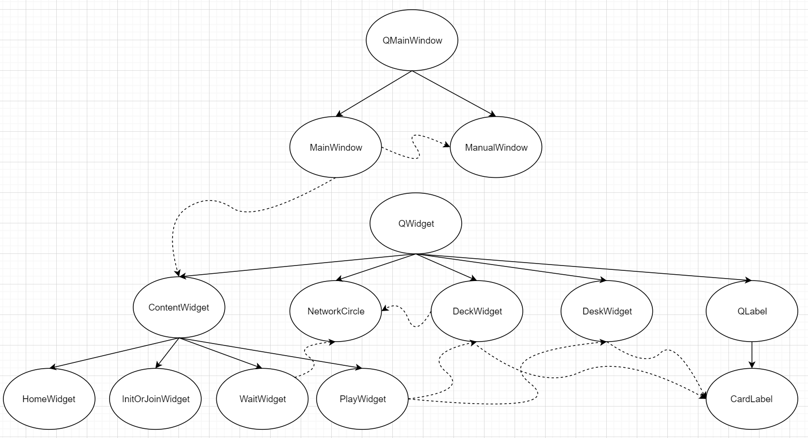

# 扑克牌游戏项目设计说明

## 一、需求分析

我们希望实现一个直观的，易上手的扑克游戏，将 windows 上的游戏“红心大战”作为参考对象，具体需求大致如下：

- 直观的 GUI 界面，用于与用户的交互，能显示4人的手牌与出牌情况，各玩家的状态（是否托管）
- 两种纸牌游戏的规则实现，能检查出牌是否合法
- 纸牌游戏的 AI 实现，用于托管或直接作为填充人数的方式
- 网络模块，用于局域网联机，应当保证传输质量，支持错误检测
- 统筹各模块的核心 API

## 二、总体设计

## 三、系统模块说明

### 逻辑模块

### 网络模块

#### 基本介绍

- 网络模块使用 winsock2 作为底层实现，对其进行进一步封装和抽象，最终实现了一个具有一定错误处理，功能定制能力的网络库。

#### 继承关系

- 网络模块继承关系如下

#### 核心类说明：

- 各 Socket 类：对 winsock 的封装，包含建立连接，收发消息，设置socket状态（阻塞、非阻塞）等功能。
- Broadcaster：UDP 广播的收发，负责发现服务器。
- DataStream：对 DataSocket 的进一步封装，用于收发带分隔消息与处理MTU限制带来的包分割，`sendLine(W)` 与 `getLine(W)` 是两个版本，分别接受 ascii 字符和 UTF16 字符。
- Client：对客户端处理服务端连接功能的封装，包括心跳，关闭连接等指令的处理，使用 `handleMessage`处理服务端信息。
- Server：对建立服务端功能的封装，包括广播与接收连接。
- Worker：对服务端处理客户端连接功能的封装，包括心跳，关闭连接等。

### AI 模块

### 界面模块

#### 基本介绍

- 界面模块基于 Qt 进行各个游戏界面的封装，最终形成一个 MainWindow 窗口类供逻辑模块进行调用，实现与用户的交互

#### 继承关系

- 界面模块继承（实线）和调用（虚线）关系如下

#### 核心类说明：

- MainWindow: 程序窗口类，提供相关方法供逻辑模块进行调用，管理用户与程序之间的交互
  - API 列表
    - `StartNetworkEventLoop`/`EndNetworkEventLoop`: 启动/停止网络事件循环，实际上是启动/停止一个定时调用网络事件处理接口的函数
    - `SetInfo`: 设置界面提示信息（不同界面都有显示提示信息的文字框）
    - `DrawHomePage`: 绘制并切换到主页
    - `DrawInitPage`: 绘制并切换到新建游戏界面
    - `DrawJoinPage`: 绘制并切换到加入游戏界面
    - `DrawWaitingPage`: 绘制并切换到等待界面
    - `AddPlayer`: 在等待界面添加玩家
    - `RemovePlayer`: 在等待界面移除指定玩家
    - `SetNetworkStatus`: 在等待界面更新指定玩家的网络信息
    - `DrawPlayingPage`: 绘制并切换到游戏界面
    - `UpdatePlayer`: 在游戏界面更新指定玩家的信息（如网络信息、是否被机器人托管等）
    - `UpdateCards`: 在游戏界面更新指定玩家的手牌状况
    - `ClearDesk`: 在游戏界面情况指定玩家的出牌区
    - `UpdateStatistics`: 在游戏界面（红心大战模式下）更新玩家积分
    - `EndGame`: 弹出游戏结束提醒对话框
- ContentWidget: 程序显示内容类，纯虚类，即窗口中除工具栏的部分
  - HomeWidget: 主页
  - InitOrJoinWidget: 新建/加入游戏页
  - WaitWidget: 等待页
  - PlayWidget: 游戏页
- ManualWindow: 帮助窗口类，显示程序使用说明
- DeckWidget: 手牌显示
- DeskWidget: 出牌区

## 四、系统设计难点与解决

### 逻辑模块

### 网络模块

- winsock2 的文档不是很完善，而且缺少例子，需要在 stack overflow 上慢慢摸索。
- 网络程序难以调试，在本机测试正常的功能在生产环境中仍然出现问题。经过与 API 负责人的漫长联合调试解决问题。
- 为了保证间接性与安全性，整个网络模块没有使用多线程。但是 c++ 缺少对单线程异步的语法工具，只能自己用一个计时器模拟，在具体使用中用轮询处理。

### AI 模块

### 界面模块

## 五、总结

### 逻辑模块

### 网络模块

- 对于一个模块而言，一开始明确具体的调用结构非常重要。实际实现中我选择了先给发出所有函数声明与引用关系，最后给出实现，大大减少了重构的次数。
- 善用命名空间和宏可以很好地整理代码。

### AI 模块

### 界面模块

## 附录一、程序使用说明

## 附录二、系统开发日志